# Cork Dork — Wine Cellar Tracker for Home Assistant

A custom Home Assistant integration and Lovelace card for managing a wine collection. Lay out your real racks, fridge shelves, bins and boxes. Add bottles by barcode, label photo or wine-list scan. Enrich them from Vivino and an AI model, and see what's ready to drink, what to hold, and how long to let a bottle warm up before serving. You can also log what you drank and how it was.

[](https://github.com/hacs/integration)

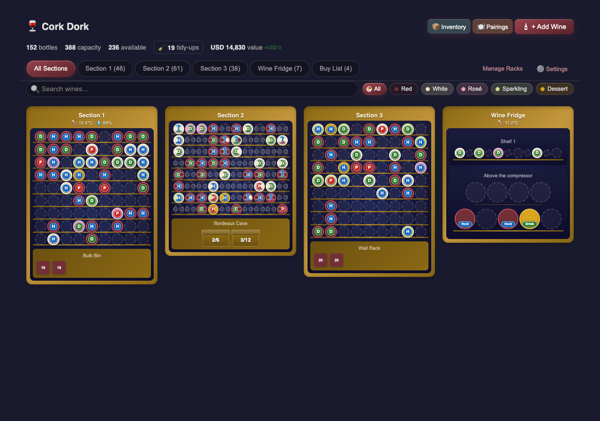

<p align="center">
  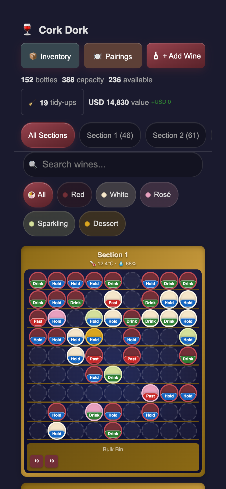
  &nbsp;&nbsp;
  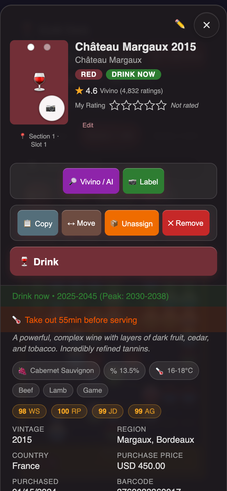
</p>

## What's new

- **Glass UI**: frosted, readable pop-ups that work under any theme, including "liquid glass" themes. Wine-type chips are colour-coded, every dialog has the same close button, and dialogs fit a phone screen without zoom-on-focus or sideways scrolling.
- **Drink button & tasting log**: drink a bottle from its detail view, rate it, jot notes, and tick *Buy again* to put it on your Buy List. History shows it all, with a *Buy again only* filter.
- **Pairings finder**: pick what you're eating (beef, seafood, cheese…) and see the bottles that go with it.
- **Rack styles**: classic grid, front/back fridge shelves, staggered (quinconce) shelves, bulk bins and wine boxes, plus an optional secondary zone stacked above or below.
- **Zone sensors & chambering advice**: attach temperature/humidity sensors to a rack and get "take it out 55 min before serving" advice based on your room temperature.
- **Peak window**: a separate peak window inside each wine's drink window, with a darker badge while the wine is at its peak.
- **Inventory review**: re-check every bottle against Vivino or the AI in one pass.
- **Fixes**: iOS barcode scanning, Vivino no longer copying "trending wine" prices or IDs onto unrelated bottles, °F serving temperatures for US-unit installs, phone pop-ups that clear the Dynamic Island, and more.

## Features

### Visual Cellar Management
- **Interactive racks**: bottles are colour-coded by type (red, white, rosé, sparkling, dessert, optional whisky) with Drink / Hold / Past badges. The single-rack view shows full word pills, and a darker green marks a wine at its peak.
- **Rack styles**: each rack is a *Classic grid*, *Shelf (Front/Back)* (fridge shelves with independent front and back lane counts), *Staggered Shelf* (quinconce rows that nest into the gaps of the row below, as above a fridge's compressor bump), *Bulk Bin* or *Wine Box*. You can add a **secondary zone** of any style above or below the main one.
- **Deep racks**: grids can be 1–6 bottles deep. Tap a deep cell to open a side panel listing every bottle front to back.
- **Visual rack editor**: live preview, stepper controls and per-rack sensors, for racks up to 20×20.
- **Drag & drop**: drag on desktop or long-press on mobile. Bottles swap if the target is occupied. **Move**, **Copy** (for multi-bottle purchases) and **Unassign** are in the detail view.
- **Tidy-ups**: the arrangement report spots scattered bottles of the same wine, mixed-type zones and similar clutter, and suggests a more logical layout.
- **Stats bar**: bottle count, capacity, free slots, cellar value and gain/loss.
- **Responsive**: separate layouts for phone, tablet and desktop, with touch-sized targets on coarse pointers.

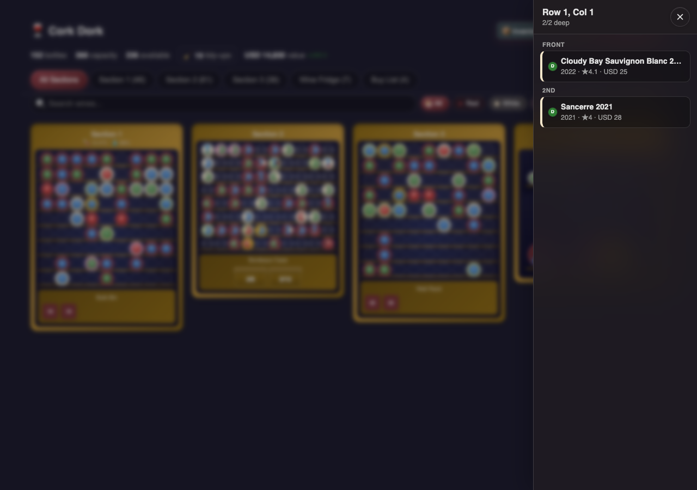

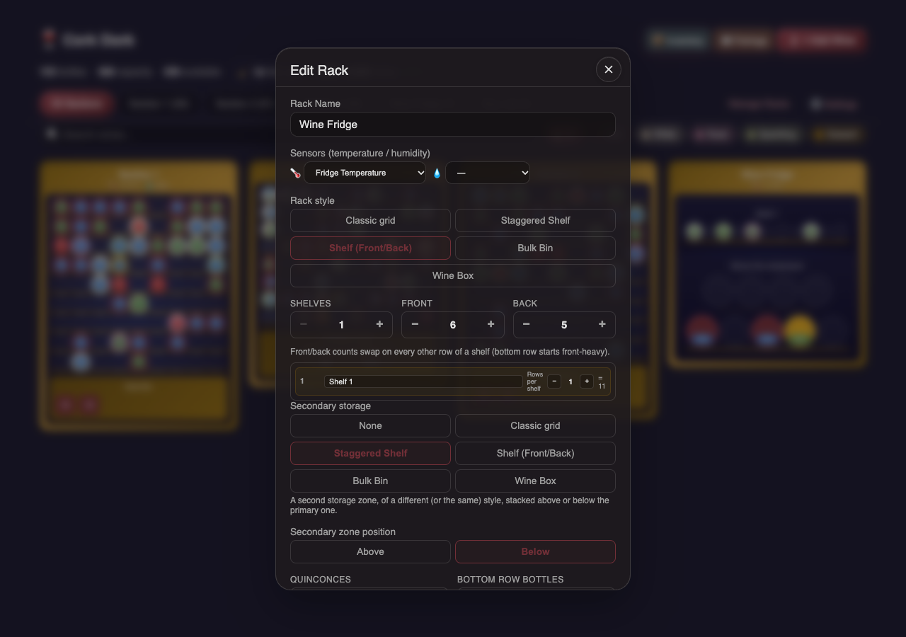

### Wine Detail
- **Drink**: a large button that archives the bottle as drunk, with an optional personal rating, notes and *Buy again*.
- **Look up**: a *Vivino / AI* button re-checks the wine (it goes straight to Vivino when no AI provider is configured). *Label* re-reads a label photo, and *Reset text* clears descriptions stuck in the wrong language.
- **Drink window & peak**: Drink now / Hold / Past peak is recomputed from the drink window automatically. No AI call is needed.
- **Chambering advice**: when a rack has a temperature sensor and you've set a room sensor, the dialog tells you how long to take the bottle out before serving, or to chill it. The estimate uses Newton's law of cooling toward the middle of the wine's serving range. Advice only appears once the bottle has sat in its rack long enough to match the sensor (24 h by default). Temperatures show in °F when Home Assistant uses US units.
- **Critic scores**: AI estimates from Wine Spectator, Robert Parker, Jeb Dunnuck and Antonio Galloni, next to the Vivino community rating and your own half-star rating.
- **Duplicates stay in sync**: refreshing or analysing one bottle updates every other bottle with the same name, winery and vintage. Location, price, purchase date and notes stay per-bottle.

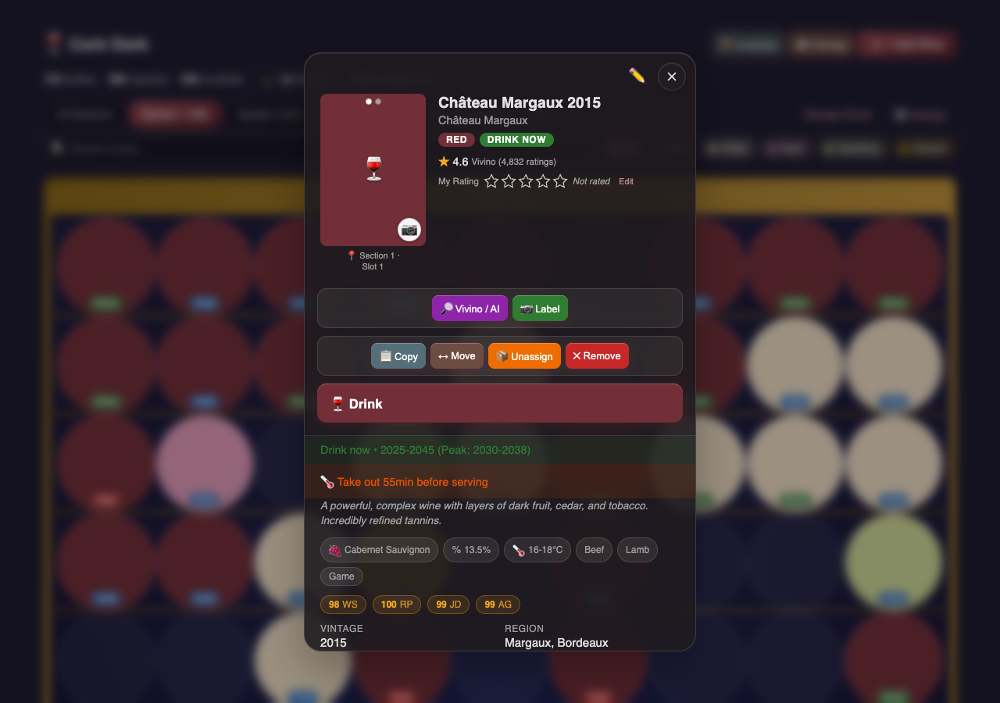

### Inventory, History & Pairings
- **Inventory**: search across name, winery, region, country, grape, vintage, barcode, notes and description. Sort by any field, filter by type chip, country, grape, cabinet, food pairing, rating, price and vintage range.
- **Presets**: one tap for *Drink this year*, *Past peak*, *Not rated*, *Missing data* or *Added recently*.
- **Inventory review**: re-check the whole cellar against Vivino's catalogue or the AI. Banners count the bottles missing pairings or a drink window, with one-tap *Fill from Vivino* / *Analyze with AI* buttons.
- **Pairings**: pick a food category (icons and bottle counts) and the inventory filters to wines that pair with it.
- **History & tasting log**: removed bottles are kept with their reason (Drank, Gifted, Sold, Broken, Spoiled, Other), your rating, notes and a *Buy again* flag. Entries can be restored or annotated later.
- **Backup & export**: CSV export and import, JSON download and upload, and timestamped server backups (`config/wine_cellar_backups/`) with a restore picker. Bottle photos are stored on disk (`config/wine_cellar_photos/`) and travel inside backups.

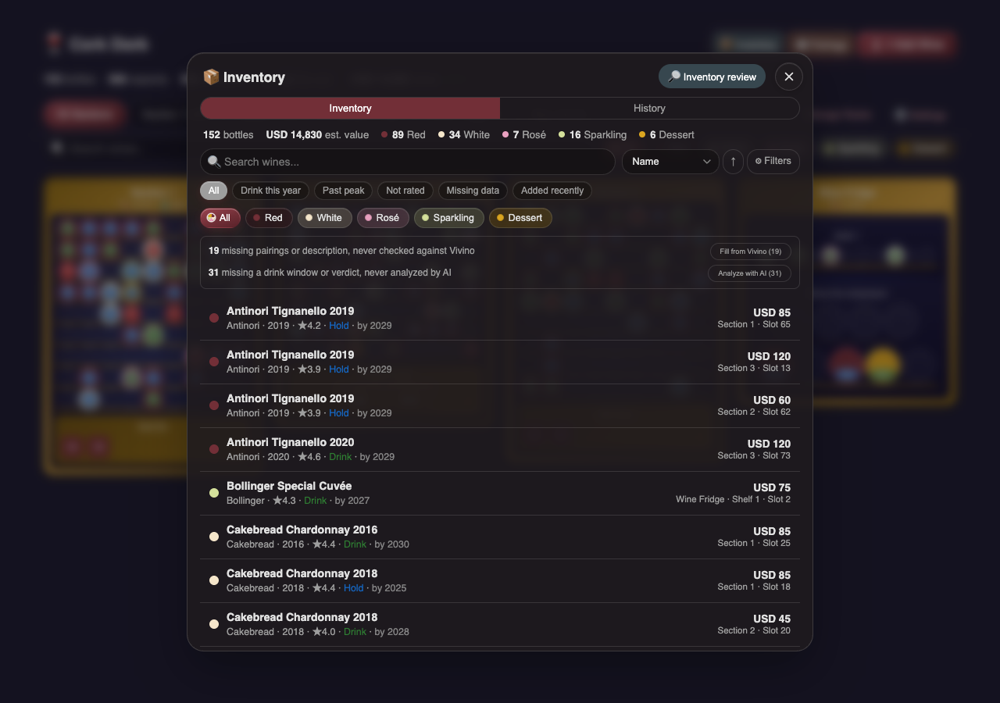

<p align="center">
  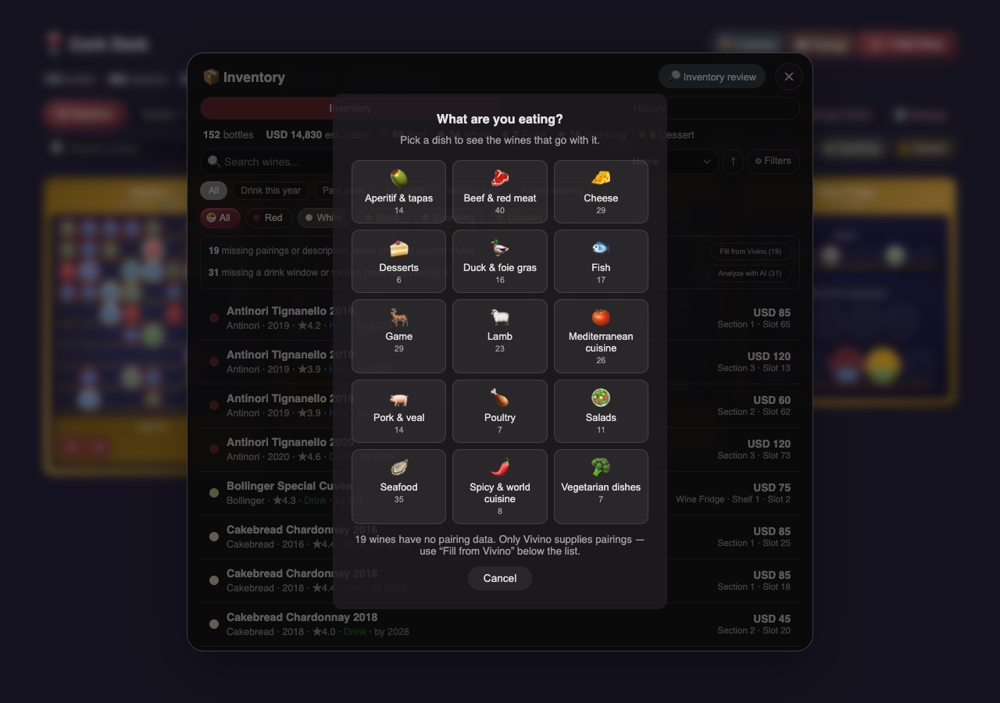
  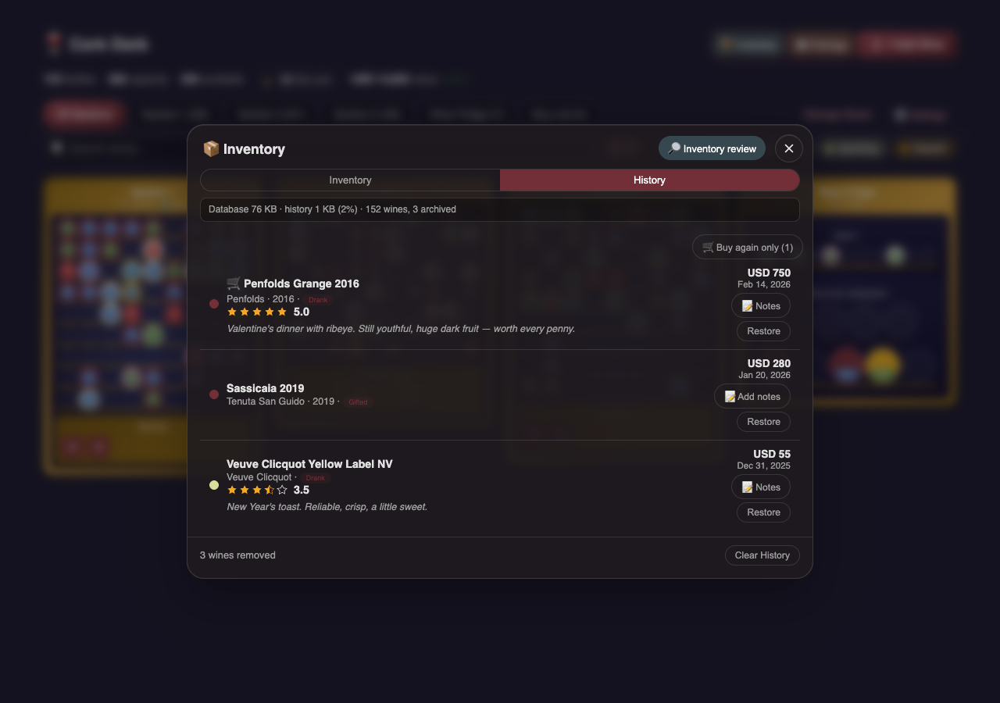
</p>

### Adding Wines
- **Scan barcode**: uses the camera, with Vivino, Open Food Facts and UPC Item DB lookups. It works on iOS too, through a bundled zxing WASM fallback that's served locally, so no CDN is needed.
- **Recognize label**: one photo gives the AI everything it needs for a full sommelier read (name, winery, vintage, type, region, grape, drink window, description, price estimate, critic scores). A Vivino lookup runs in the background to add a rating and photo.
- **Scan wine list**: photograph a restaurant list or a receipt. Every wine is extracted with critic scores, retail price and markup, best-value picks are highlighted, and an *In cellar* badge marks wines you already own. Add any of them to the cellar or the Buy List.
- **Search by name** or **enter manually**. New bottles are auto-enriched from Vivino in the background.

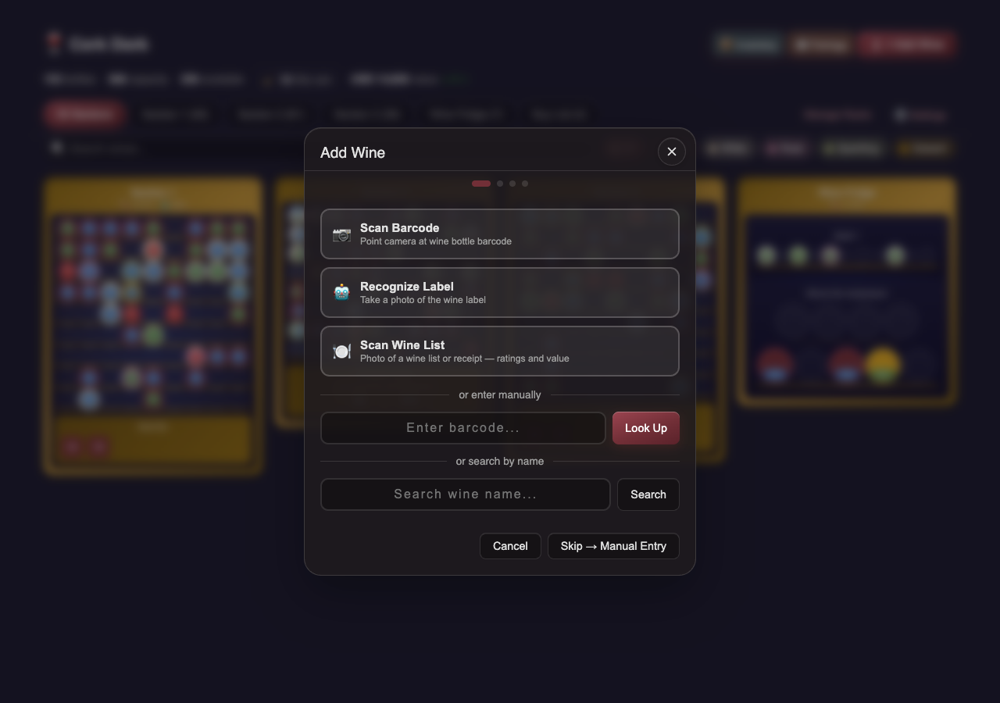

### Buy List
- A wishlist with full detail (ratings, prices, notes). Add to it from a wine-list scan, the Add Wine dialog or a *Buy again* tick, and move an item into a rack with one tap.

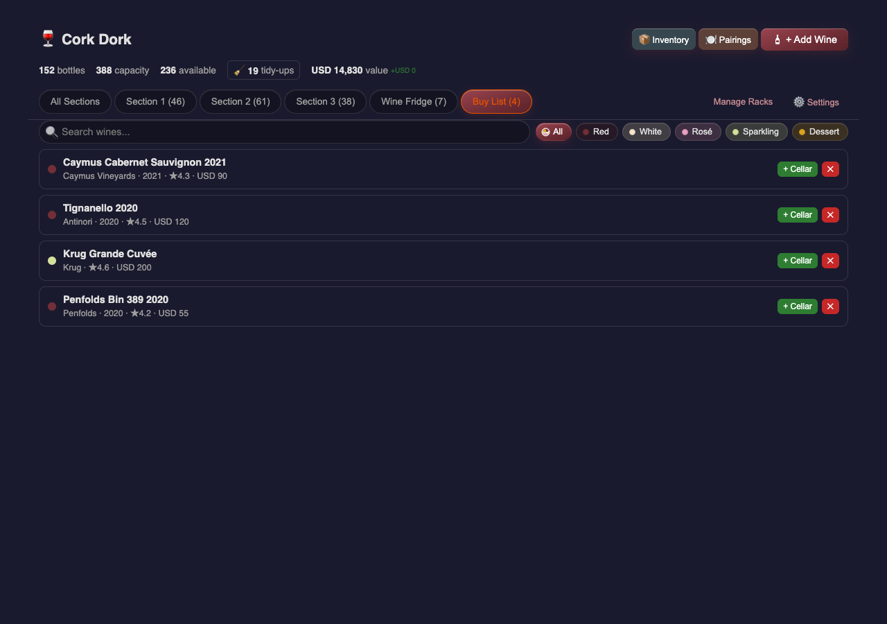

### AI
- **Providers**: Google Gemini directly, or any **OpenAI-compatible** endpoint (base URL + key + model).
- **What it adds**: tasting descriptions, drink and peak windows, disposition, food pairings, critic score estimates, and a price estimate when Vivino has none.
- **Language & currency**: AI and Vivino text in English, French or German, with prices in USD, EUR, GBP or CHF. Descriptions are regenerated automatically when you change language.

### Vivino
- **Cellar connection**: paste your cellar URL and session cookie once (see **[docs/vivino-import.md](docs/vivino-import.md)**). After that, one tap imports every bottle you own as unassigned wines, without duplicates.
- **Import or Synchronize**: *Import* (the default) is a one-way mirror that never writes to Vivino. *Synchronize* is a two-way reconcile: bottles added or drunk in Cork Dork are pushed back as Vivino cellar events. It is guarded so that a bad fetch can't wipe either side.
- **You pick the bottle**: when Vivino loses a bottle and it's ambiguous which physical one is gone, candidates are ringed in orange in your racks and you confirm the right one. Conflicting edits on both sides are shown for you to settle, not guessed.
- **Auto sync** twice a day, with a notification when the cookie expires.
- **Batch and single refresh**: ratings, descriptions, food pairings, alcohol and grape. Once a wine has a Vivino ID it is refreshed from Vivino's by-ID API, and any ID that turns out to name a different wine is dropped.

### Whisky (opt-in)
- Turn on *Track whisky bottles* in Settings to get a Whisky type. *Winery* becomes *Distillery*, *Grape Variety* becomes *Cask*, and *Vintage* is the distillation year. Vivino is skipped for whisky. The AI handles it with its own rules: always Drink Now, no critic scores.

### Languages
- The card follows Home Assistant's display language (**English** and **French** today), and so do the integration's setup and options screens. Sensor units are localised too.

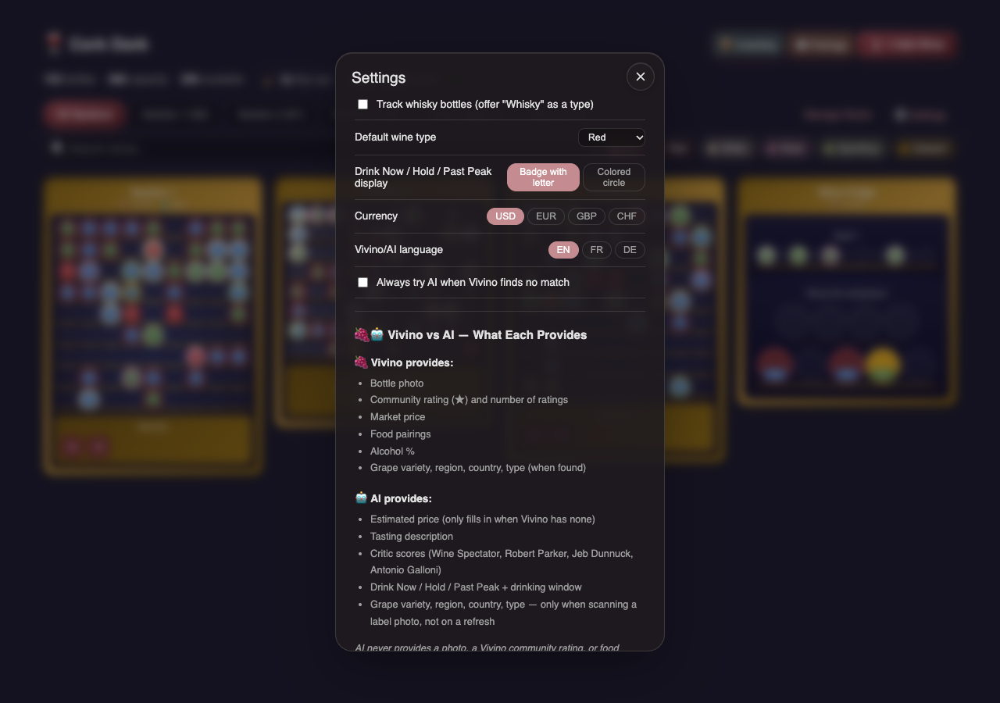

## Installation

### HACS (Recommended)

1. Open HACS in your Home Assistant instance
2. Click the three dots in the top right and select **Custom repositories**
3. Add `https://github.com/cojaski/ha-wine-cellar` with category **Integration**
4. Search for **Cork Dork** and click **Install**
5. Restart Home Assistant, then hard-refresh your browser (Cmd/Ctrl+Shift+R)

### Manual

1. Copy the `custom_components/wine_cellar` folder into your Home Assistant `custom_components` directory
2. Restart Home Assistant

## Setup

1. Go to **Settings > Devices & Services > Add Integration**
2. Search for **Cork Dork** and follow the setup flow
3. Add the card to a dashboard (it's registered as a Lovelace resource automatically on storage-mode dashboards):

```yaml
type: custom:wine-cellar-card
title: Cork Dork
```

### AI Features (Optional)

1. Get a free Gemini API key from [Google AI Studio](https://aistudio.google.com/apikey), or use any OpenAI-compatible provider
2. Go to **Settings > Devices & Services > Cork Dork > Configure**
3. Pick the provider and enter the key (plus the base URL and model for OpenAI-compatible providers)

This unlocks label recognition, wine-list scanning, AI look-ups on single wines, AI in the Inventory review, and AI price estimates.

### Chambering (Optional)

1. In **Manage Racks**, edit a rack and pick its temperature (and optionally humidity) sensor
2. In **Cork Dork > Configure**, choose a **room temperature sensor**. You can also tune the warm-up time constant (default 75 min, a rough starting point) and the equilibration time (default 24 h)

Wines need a serving temperature (e.g. `16-18°C`), which Vivino or the AI usually supplies.

### Connecting Your Vivino Cellar

Vivino has no public API for your own cellar. Cork Dork reads it from `www.vivino.com` by replaying a session cookie you paste from your browser. **[docs/vivino-import.md](docs/vivino-import.md)** covers both methods:

- **Integration sync (recommended)**: paste your cellar URL and session cookie in **Cork Dork → Configure**, then use **⬇️ Vivino Import** / **🔄 Vivino Sync**, or enable auto-sync.
- **One-time CSV export**: run a browser-console snippet and load the file via **📦 Inventory → Import CSV**.

## Default Cabinet Layout

Three cabinet sections ship by default, each 10 rows × 9 columns, with a bulk bin as the bottom row. Everything can be changed in **Manage Racks**: names, size (up to 20×20), depth (1–6), rack style, secondary zone and sensors.

## Data Sources

| Source | Data Provided |
|---|---|
| **Vivino** | Name, winery, region, country, type, vintage, community rating & count, image, grape, description, food pairings, alcohol %, your cellar (with a session cookie). Prices are rarely available. |
| **Open Food Facts** | Name, brand, origin, country, image (barcode lookup) |
| **UPC Item DB** | Name, brand (barcode lookup) |
| **AI (Gemini or OpenAI-compatible)** | Label recognition, wine-list extraction, description, drink & peak windows, disposition, food pairings, critic score estimates, price estimate |

## Services

| Service | Description |
|---|---|
| `wine_cellar.add_wine` | Add a wine bottle to your collection |
| `wine_cellar.remove_wine` | Remove a wine bottle (optional reason: drank, gifted, sold, broken, spoiled, other) |
| `wine_cellar.move_wine` | Move a wine to a different cabinet/position |
| `wine_cellar.scan_barcode` | Look up a barcode and fire a result event |
| `wine_cellar.sync_vivino` | Import/sync your Vivino cellar and wishlist (target: all, cellar, or wishlist) |

## Sensors

| Entity | Description |
|---|---|
| `sensor.cork_dork_total_bottles` | Total bottles in your cellar |
| `sensor.cork_dork_capacity` | Percentage of cellar capacity used |
| `sensor.cork_dork_<rack name>` | Bottle count per rack |
| `sensor.cork_dork_vivino_cellar` | Bottles in your Vivino cellar at last sync (sync details as attributes) |

## Credits

Originally created by [BaconWappedBitcoin](https://github.com/BaconWappedBitcoin/ha-wine-cellar), with features contributed across several community forks.

## License

MIT
